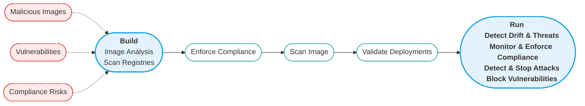
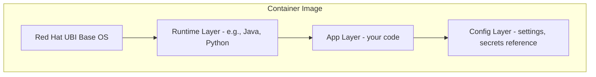

# Lab B0: Container Security Fundamentals

---

## Skill

Understand the core principles, benefits, and common risks in container security.
By the end, you’ll know what makes containers powerful, where their weaknesses lie, and how Red Hat OpenShift helps keep them secure.

---

## Objective

- Grasp what containers are and how they’re built
- Learn why containers offer security benefits (and what their limits are)
- Map out the main risks and attack surfaces in containerized environments
- See the key controls and solutions for container security (with Red Hat examples)
- Prepare for deeper, hands-on labs ahead

---

## Container Security Explained

Containers have revolutionized how we package and deliver software, letting teams move fast and work consistently across different environments—from laptops to production clusters.
Their design comes with built-in isolation, small footprints, and rapid startup times. But securing containers is about more than just using the right base image—it’s a process that starts at build time and continues through to runtime, leveraging the right platform and tools at every step.

**Why containers are adopted:**
- **Speed:** Rapid build and deployment cycles enable agile delivery.
- **Consistency:** “Works on my machine” really means everywhere.
- **Isolation:** Each container gets its own environment, minimizing interference.

Red Hat OpenShift enhances container security by default: running as non-root, strong RBAC, enforced network controls, and integrated vulnerability scanning via Red Hat Advanced Cluster Security (RHACS).

---

## Understanding the Attack Surface

| Attack Surface Area                           | Attack Vector                                 | Description                                                                                      | Example                                                                                                   |
|-----------------------------------------------|------------------------------------------------|--------------------------------------------------------------------------------------------------|-----------------------------------------------------------------------------------------------------------|
| Via Network                                   | Malicious Network Traffic                      | Attackers may exploit weak or misconfigured network settings to infiltrate containerized environments.      | Probing for open ports and leveraging network gaps to access cluster nodes.                  |
| Host Configuration                            | Misconfigured Host System                      | Poorly set up host systems can open doors for unauthorized access to containers.    | Finding world-writable files or directories that expose sensitive configuration data.    |
| Host Vulnerabilities                          | Unpatched Host Vulnerabilities                 | Outdated or vulnerable host operating systems can be a launchpad for attacks on containers.      | Exploiting a kernel bug to escalate privileges on a node.       |
| Host Application Vulnerabilities              | Unpatched Host Application Vulnerabilities     | Applications running on the host, if not secured, can be leveraged to compromise containers.              | Exploiting a flaw in an old Docker version to gain unauthorized access.           |
| Container Orchestration Vulnerabilities and Misconfigs | Misconfigured Container Orchestration   | Weaknesses or errors in orchestration tools can expose workloads to risk. | Using overly permissive Kubernetes RBAC to access or control pods.   |
| Compromised Container Images                  | Attacker Gains Access to Container Image Build Process | If attackers tamper with the image build process, they can introduce malicious code into containers.   | Injecting malware into images via a vulnerable CI/CD pipeline. |
| Container Vulnerabilities and Misconfigs      | Unpatched Container Vulnerabilities            | Vulnerabilities or misconfigurations inside containers themselves can be exploited.           | Exploiting a known bug in a containerized web app to gain a foothold.      |
| Container Escape                             | Attacker Gains Privileged Access to Container  | Breaking out of the container’s isolation can allow attackers to reach the underlying host.                         | Abusing a container runtime flaw to execute commands on the host OS. |

Table 1: Key areas and vectors in the container attack surface

The good news is that OpenShift’s comprehensive security model—spanning hardened defaults, integrated policy controls, and continuous monitoring—directly addresses these risks. By leveraging OpenShift’s layered security features, you can significantly reduce the likelihood and impact of attacks at every layer of the container stack.



---

## How to Secure Containers

Securing containers is a team sport-blending best practices, platform features, and dedicated security tooling. 

Here’s how you lock down the most critical areas:

### 1. Build Phase (“Shift Left”)
- Use official, minimal, and regularly updated images (prefer Red Hat UBI where possible)
- Scan images for vulnerabilities before deployment (RHACS, OpenShift Pipelines)
- Never store secrets in images; use OpenShift/Kubernetes Secrets instead

### 2. Registry Security
- Host images in a trusted registry (OpenShift includes an integrated registry)
- Enforce authentication and signed images
- Monitor for image changes or new CVEs (RHACS can notify on registry changes)

### 3. Deployment & Orchestration
- Apply RBAC and least-privilege principles (OpenShift RBAC and SCCs)
- Require containers to run as non-root, block privileged escalation (OpenShift SCC/RHACS)
- Enforce network policies to segment workloads

### 4. Runtime Protection
- Monitor for unexpected process or network activity (RHACS runtime)
- Continuously scan running containers for new vulnerabilities (RHACS,QUAY)
- Log and audit every critical action, use OpenShift audit logs and integrate with SIEMs

---

## Container Security Solutions

### Container Monitoring

Keeping an eye on your cluster’s health and security posture is critical. With Red Hat OpenShift, you can:
- Use built-in monitoring for real-time metrics
- Integrate with Red Hat Advanced Cluster Security (RHACS) for deep runtime visibility and threat detection
- Export logs to external SIEM platforms for correlation and alerting

### Container Scanning Tools

Detect issues before they reach production. With OpenShift and Red Hat tooling:
- **Image scanning:** OpenShift integrates with RHACS to scan images for CVEs, misconfigurations directly in your pipeline or at runtime.
- **Continuous assessment:** RHACS can automatically rescan images in registries, flagging new issues as they arise.

### Container Network Security Tools

Protect traffic inside and outside the cluster:
- **NetworkPolicy (native in OpenShift/Kubernetes):** Control which pods can talk to each other or reach the outside world.
- **Service Mesh (Red Hat OpenShift Service Mesh):** Add encryption, mTLS, and advanced traffic control.
- **Container firewalls:** Use tools like RHACS to enforce network baselines and detect lateral movement.

### Automated Security & Compliance Controls

Automate your guardrails:
- **Red Hat Advanced Cluster Security (RHACS):**
  - Define, enforce, and automate organization-wide security policies for containers and Kubernetes.
  - Enforce image scanning and only allow deployments from trusted registries.
  - Block deployments with privilege escalation or missing labels.
  - Alert or block on critical runtime behaviors and configuration drift.
- **Network Policies & Resource Quotas:**
  - Automate segmentation and resource governance.
  - Control pod-to-pod and namespace-to-namespace traffic.
  - Limit resource consumption (CPU, memory, storage) per namespace.
  - Prevent resource exhaustion and denial-of-service.
- **Automated Compliance & Drift Detection:**
  - Continuously monitor clusters for policy violations and configuration drift.
  - Receive alerts or trigger enforcement actions when standards aren’t met.

⸻

## Visual: Container Image Layers



---

## Key Concepts for Container Security

| Concept           | What It Means                                 | Why It Matters                        |
|-------------------|-----------------------------------------------|---------------------------------------|
| Minimal Images    | Small, official images with only what you need| Less bloat, fewer CVEs, smaller risk  |
| Non-root User     | Don’t run as root in containers               | Contain compromise impact             |
| Network Controls  | NetworkPolicy, SDN segmentation               | Block attacker movement               |
| Image Scanning    | Automatic scans for vulnerabilities           | Prevents deploying bad images         |
| Signed Images     | Only deploy trusted/signed sources            | Stop tampering, verify provenance     |
| Runtime Monitoring| Detect unusual processes/connections          | Catch attacks in progress             |
| Regular Updates   | Patch OS, images, platforms frequently        | Avoid old/exploited bugs              |

---

## Quick Demo: A Simple Security Failure

Imagine you deploy a pod with default settings and an untrusted image:

```yaml
apiVersion: v1
kind: Pod
metadata:
  name: badpod
spec:
  containers:
    - name: badcontainer
      image: randomuser/old-httpd:latest
      ports:
        - containerPort: 80
      securityContext:
        runAsUser: 0
```

- **Risk 1:** Running as root—no isolation if exploited
- **Risk 2:** Unverified, possibly vulnerable image
- **Risk 3:** Exposes a privileged port

A single mistake can put the whole cluster at risk.

---

## How to Make It Secure (with Red Hat Tools)

- Use official Red Hat UBI or certified images: Always start from a trusted base
- Set non-root user with SCCs: Enforce at deployment
- Scan images with RHACS or integrated tools: Automate in your build pipeline
- Apply OpenShift NetworkPolicy: Segment traffic by workload, app, or team
- Keep OpenShift and components up to date: Regular updates fix newly discovered risks

---

## Summary Table

| Layer         | What to Secure                    | How to Secure It (Red Hat/OpenShift)                                                  |
|---------------|------------------------------------|----------------------------------------------------------------------------------------|
| **Image**     | Dependencies, vulnerabilities      | Use Red Hat UBI → Scan with RHACS Scanner → Enforce signed images via image policy   |
| **Registry**  | Access, image provenance           | Use integrated OpenShift registry (internal by default) → Restrict with allowedRegistries CR |
| **Host OS**   | Kernel, OS configuration           | RHCOS/RHEL hardened via Compliance Operator → auto-updates and compliance scans |
| **Runtime**   | Container processes & configs      | RHACS runtime policies → enforcement on drift/drift detection |
| **Network**   | Traffic flow & segmentation        | Enforce Kubernetes/Openshift NetworkPolicy or Service Mesh (mTLS) |
| **Orchestration** | RBAC, secrets, audit             | OpenShift RBAC + SCCs for least privilege → Automated audit logging & Compliance Operator |
---

## Key Points

- Containers provide strong isolation, but only if you follow security best practices throughout the lifecycle
- Key risks include misconfigured containers, outdated images, excessive privileges, and open networks
- OpenShift and Red Hat tools provide built-in controls, use them!
- Security is not “one and done”: scan, monitor, restrict, and respond continuously

---

## Container Security FAQs

**What is a container image?**
A file that packages all your app’s code, runtime, and libraries. Containers are started from these images.

**What is a container registry?**
A secure storage and distribution system for container images—OpenShift includes its own integrated registry.

**What is code security?**
Writing and checking application code to avoid bugs, vulnerabilities, and secrets leaks—use static analysis and code reviews.

**How do policies and infrastructure as code differ?**
IaC describes the infrastructure you want to run (servers, networks, clusters), while policies describe the rules and controls over how that infrastructure can be used (e.g., which images, who can deploy).

**What is policy as code (PaC)?**
PaC means expressing your security and operational rules in files, so they can be checked and enforced automatically (for example, with OPA or Gatekeeper).

**What is a policy engine?**
A system like OPA or RHACS that checks whether actions/configurations follow security and compliance rules.

**What is a CVE?**
A public identifier for a known software vulnerability—scanning images for CVEs helps avoid deploying risky software.

**What is a security context or SCC?**
Settings (Kubernetes) or enforced policies (OpenShift SCC) that define how a container runs—e.g., user, privileges, Linux capabilities.

**What are network policies?**
Kubernetes/Openshift rules that control how containers communicate, preventing unauthorized access and lateral movement.

**What is the MITRE ATT&CK Matrix?**
A widely used framework describing known adversary tactics and techniques, used to guide security monitoring and response.

**What is an audit event?**
A record of key actions (like user logins or resource changes)—OpenShift provides audit logs to help track and investigate incidents.

**What is authentication?**
Confirming who a user or process is (login, certificates, etc.).

**What is authorization?**
Deciding what a user or process is allowed to do, based on roles and policies.

**What is User Entity and Behavior Analytics (UEBA)?**
A security approach using behavioral analytics and machine learning to spot unusual, risky, or suspicious activities in the environment.